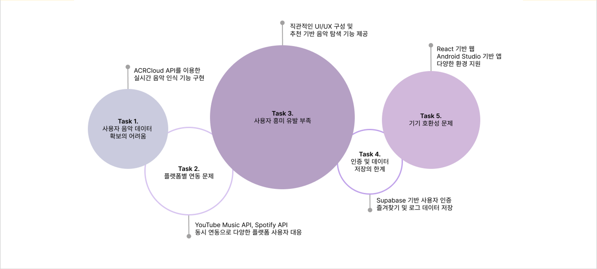
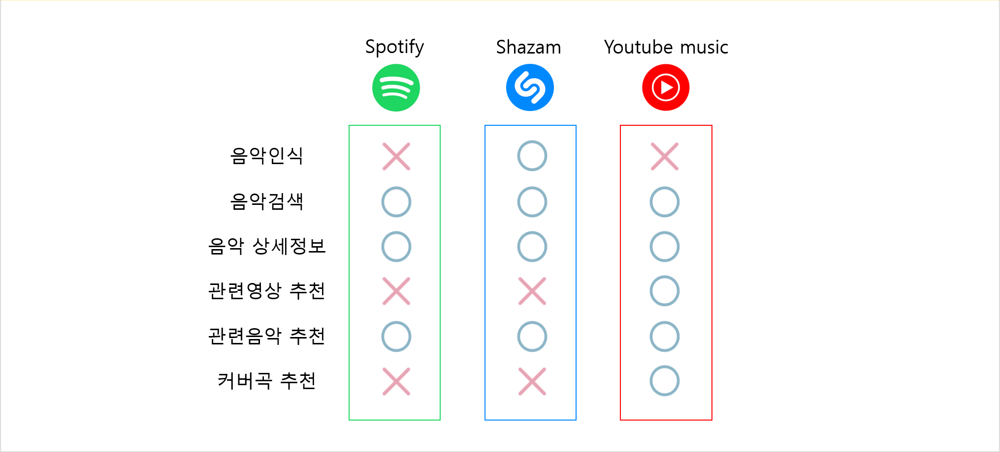
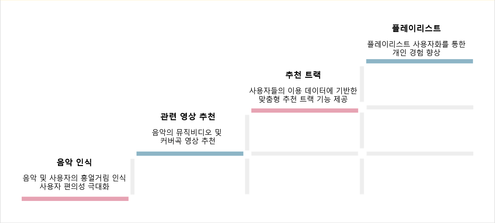
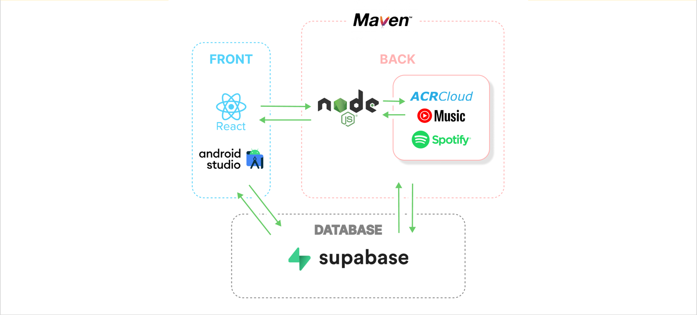
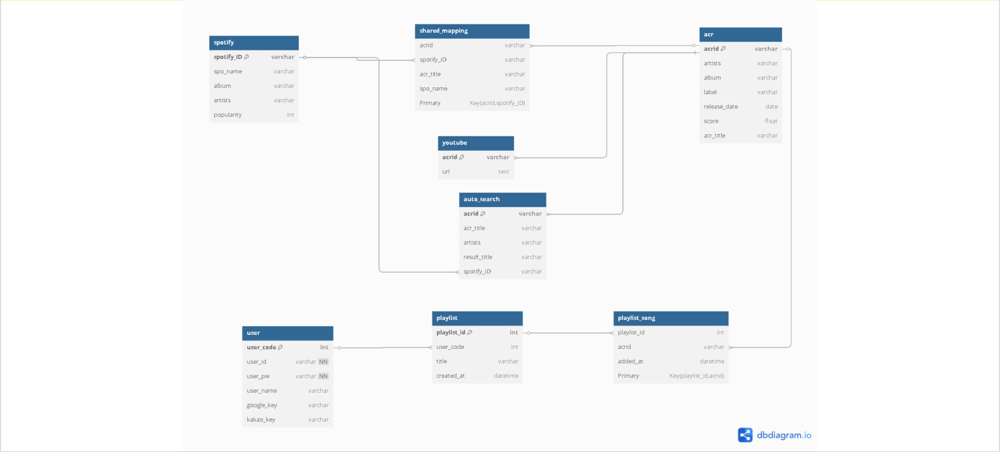

# dmu_sound 🎧


## 프로젝트 개요

사용자의 주변 음악이나 흥얼거림을 인식하여, 해당 음악 정보를 기반으로 YouTube 영상 및 Spotify 트랙을 제공하는 웹 애플리케이션입니다.


---

## 경쟁분석


---

## 프로젝트 목표


---

## 시스템 구성도


## ERD


---

## 팀 멤버 소개

| **이름** | **역할** |
|:--------:|:--------:|
| 권현우 | 앱 기능, 백엔드, DB담당 |
| 황주석 | 프론트엔드(React), UI 설계, 발표 준비 |
| 신동욱 | 백엔드(Spring) |
| 정지훈 | 프론트엔드(React) |
| 김경환 | 프로젝트 기획, DB 초기 설계, 회의 진행 및 역할 분배, 기능 병합 |

---

## 개발 환경

- **Frontend**:   
- **API**:   
- **디자인**: 
- **협업 툴**:  

---

## 주요 기능

- 🎙️ **음악 인식**: ACRCloud API를 활용하여 주변 음악 및 사용자 흥얼거림 인식
- 🔍 **관련영상 추천**: 음악의 뮤직비디오 및 커버곡 영상 추천
- 🎵 **추천 트랙**: 사용자들의 이용 데이터에 기반한 맞춤형 추천 트랙 기능 제공
- 📄 **플레이리스트**: 플레이리스트 사용자화를 통한 개인 경험 향상

---

## 프로젝트 구조

```plaintext
dmu_sound/
├── index.html
├── css/
│   └── styles.css
├── js/
│   ├── acrcloud.js
│   ├── spotify.js
│   └── youtube.js
├── ppt_images/
│   ├── system_diagram.png
│   ├── erd_diagram_1.png
│   └── erd_diagram_2.png
└── README.md
